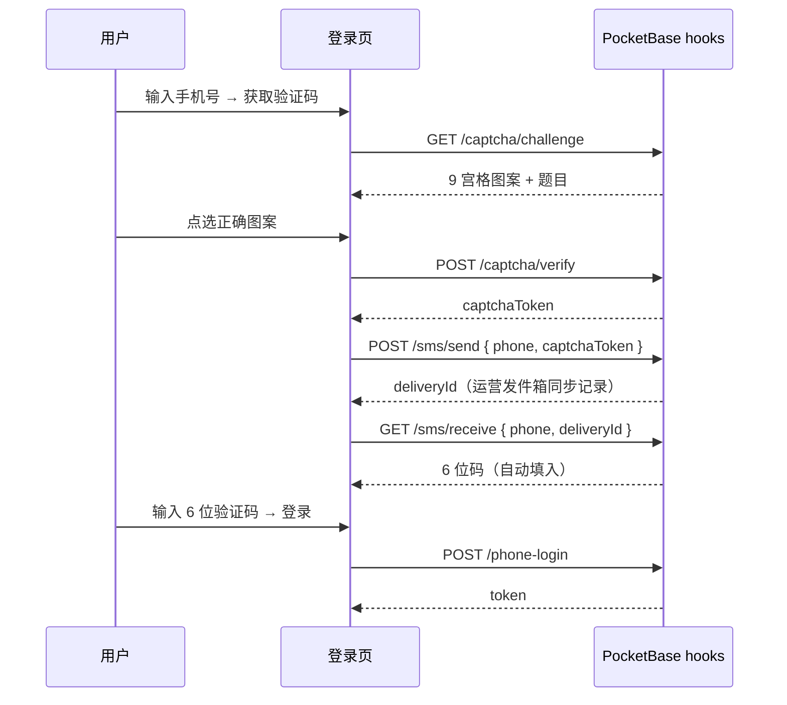

# 自建短信验证 + 安全图画点选

不接入阿里云/腾讯云等第三方短信平台。验证码在 **PocketBase hooks 服务器**生成、校验与记录。

## 流程

## API

| 方法 | 路径 | 说明 |
|------|------|------|
| GET | `/api/nuanban/captcha/challenge` | 获取 9 宫格图画题 |
| POST | `/api/nuanban/captcha/verify` | `{ challengeId, selectedIds[] }` → `captchaToken` |
| POST | `/api/nuanban/sms/send` | `{ phone, captchaToken }` → 生成 6 位码 + `deliveryId` |
| GET | `/api/nuanban/sms/receive?phone=&deliveryId=` | 用户端一次性领取验证码（自动填入） |
| POST | `/api/nuanban/phone-login` | `{ phone, code }` — **必须 6 位** |
| GET | `/api/nuanban/platform/sms-outbox?key=nuanban2026` | 运营发件箱（最近 30 条） |

## 验证码投递（自建通道）

| 环境 | 用户如何拿到验证码 |
|------|-------------------|
| **本地开发** | `sms/send` 响应含 `devCode`，或 `deliveryId` 轮询自动填入 |
| **演示号** `13800000001`–`06` | 可直接输入 **`000000`** 登录（仅 Mock；正式环境不可用） |
| **GitHub 发布版 / 阿里云** | 用户端完成点选后 **自动轮询 `sms/receive` 填入**；运营发件箱同步可见 |
| **未来** | 可替换 `sms/send` 内部实现为真实 SMS，接口不变 |

## 安全图画点选

- 题目示例：「请点选所有【动物】图案」
- 9 格 emoji，需点中全部正确项
- 通过后获得一次性 `captchaToken`（5 分钟），才能发短信
- 防机器人刷验证码；无需第三方 CAPTCHA 服务

## 订单密聊语音

服务中订单支持 **按住说话**（最长 60 秒），与文字并存。见 `ORDER_CONTACT.md`。
